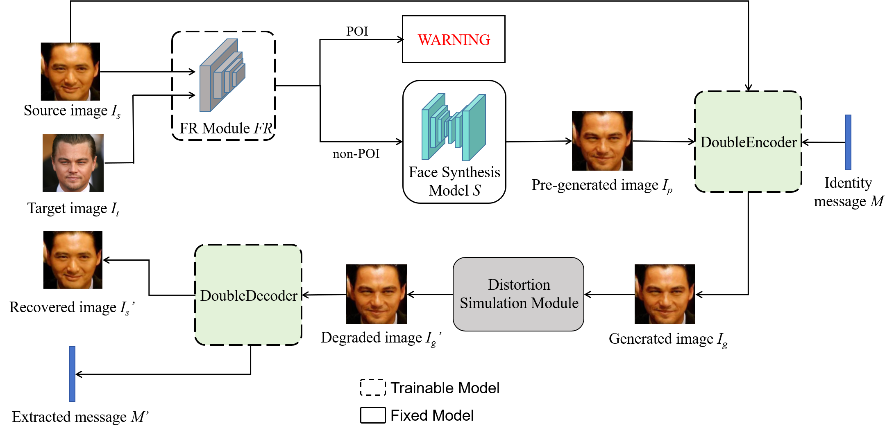

# Provider-oriented Active Defense Method against face synthesis
 


## Pipeline
### Preprocessing
Extracting face images with MTCNN:
``` python
python ext_ff.py
```

Generating face landmarks with dlib:
``` python
python save_dlib_mask/generate_landmarks_dlib_ff_df_save_img.py
```

Splitting the dataset and getting the txt:
``` python
python get_txt.py
```


### Training
Training the FaceHideNet:
``` python
python main_face.py
```
Training the MessageEncoder-Decoder:
``` python
python main_wm.py
```
### Inference
1. You can adjust the test items with preset parameters in the file
``` python
python main_face_wm.py

